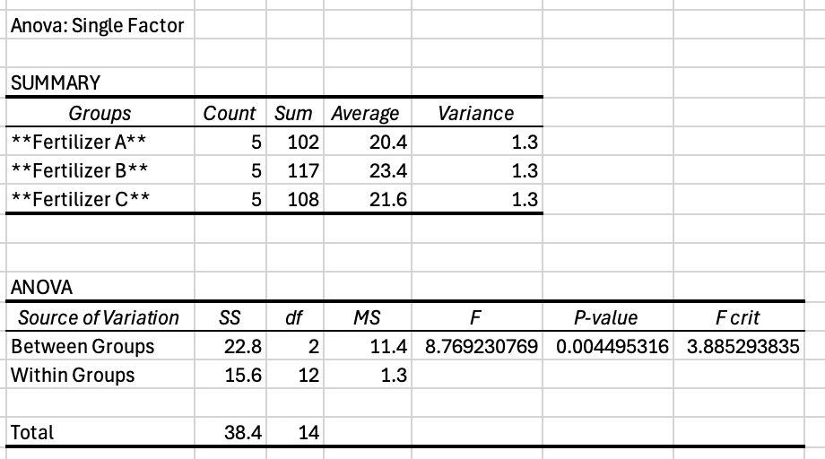

* tesst
{:toc}

# Guide to Hypothesis Testing

Hypothesis testing is a fundamental statistical tool used to make inferences about a population based on sample data. In this class, we'll take a 7-step approach to hypothesis testing:

### Summary of the 7-Step Hypothesis Testing Process:

1. **State the null and alternative hypotheses**.
2. **Choose the significance level ($$ \alpha $$)**.
3. **Determine the appropriate test statistic**.
4. **Identify the random sampling distribution (RSD)**.
5. **Find the critical value** or decide to use a **p-value approach**.
6. **Perform the calculations** for the test statistic and/or p-value.
7. **Draw a conclusion** based on the comparison of the test statistic with the critical value or the p-value with \( \alpha \). Write an appropriate "We Have Sufficient Statistical Evidence To Infer That..." Statement

# The T-Test (Location)

The **T-Test** is commonly used to test hypotheses about population means, particularly when the sample size is small and/or the population standard deviation is unknown.

## One-Sample T-Test

The **One-Sample T-Test** is used to determine whether the mean of a single sample is significantly different from a known or hypothesized population mean.

### Assumptions:
1. **Independence**: Observations must be independent of each other.
2. **Normality**: The sample should be drawn from a normally distributed population (approximately true for small samples; for larger samples, the **Central Limit Theorem** applies).

### Hypotheses:
- **Null Hypothesis $$( H_0 ) $$**: The population mean is equal to the hypothesized mean.
  $$
  H_0: \mu = \mu_0
  $$
- **Alternative Hypothesis $$( H_a )$$**:
  - **Two-tailed test**: The mean is different from the hypothesized value.
    $$
    H_a: \mu \neq \mu_0
    $$
  - **Left-tailed test**: The mean is less than the hypothesized value.
    $$
    H_a: \mu < \mu_0
    $$
  - **Right-tailed test**: The mean is greater than the hypothesized value.
    $$
    H_a: \mu > \mu_0
    $$

### Formula:

$$
t = \frac{\bar{x} - \mu_0}{\frac{s}{\sqrt{n}}}
$$

Where:
- $$ \bar{x} $$ = sample mean
- $$ \mu_0 $$$ = hypothesized population mean
- $$ s $$ = sample standard deviation
- $$ n $$ = sample size

### Example (Left-Tailed Test):
A battery manufacturer claims that its batteries last **100 hours** on average. A sample of 10 batteries has a **mean lifespan of 95 hours** with a standard deviation of **8 hours**. 
#### Step 1: State Null and Alternative Hypothesis

$$
H_0: \mu = 100
$$

$$
H_a: \mu < 100
$$

#### Step 2: State the Maximum Risk You Are Willing TO Accept of Committing A Type 1 ($$\alpha$$) error:

We set **$$ \alpha = 0.05 $$**, meaning we are willing to accept a **5% chance** of incorrectly rejecting the null hypothesis.

#### Step 3: State the Test Statistics

The test statistic for a one-sample t-test is: $$ t = \frac{\bar{x} - \mu_0}{\frac{s}{\sqrt{n}}} $$

#### Step 4: Identify the Random Sampling Distribution (RSD) of the Test Statistic When H0 Is True; and Whether This is an Exact or Approximate Test 

- The test statistic follows a **t-distribution** with \( df = n - 1 \).
- Since we have \( n = 10 \), the **degrees of freedom (df) = 9**.
- This is an **exact test**, assuming the normality assumption holds.

#### Step 5: State the Criteria for Rejecting the Null Hypothesis 

- **Critical value approach**: Reject $$ H_0 $$ if **$$ t $$ is less than** the critical value at $$ \alpha = 0.05 $$
- **p-value approach**: Reject $$ H_0 $$ if p-value < $$\alpha$$.

  

#### Step 6: Calculations

$$
t = \frac{95 - 100}{\frac{8}{\sqrt{10}}} = -1.976
$$

Using a **one-tailed t-table** with **df = n - 1 = 9** at $$ \alpha = 0.05 $$, (`=T.INV(0.05,9)`), we find the critical value is **-1.833**.

Using a **one-tailed t-table** with **df = n - 1 = 9** at $$ t=-1.976$$, (`=T.DIST(B2,9,TRUE)``), we find the p-value is $$0.040$$

#### Step 7: Conclusions
Since **-1.976 < -1.833** and that **$$p=0.04 < \alpha =0.05 $$**, we **reject $$ H_0 $$** and conclude that **We Have Sufficient Statistical Evidence To Infer that** the battery lifespan is significantly lower than 100 hours.

### Example (Two-Tailed T-Test):
A fruit supplier claims that the average weight of apples in their orchard is **150 grams**. A researcher randomly samples **15 apples** and finds that the **sample mean weight** is **148 grams**, with a **sample standard deviation of 8 grams**.

We want to test whether the **average weight of apples is significantly different from** 150 grams at a **significance level of $$ \alpha = 0.08 $$**.

#### Step 1: State the Null and Alternative Hypotheses
We set up the hypotheses as follows:

- **Null Hypothesis ($$H_0$$)**: The population mean is equal to 150 grams.
  $$
  H_0: \mu = 150
  $$
  
- **Alternative Hypothesis ($$H_a$$)**: The population mean is **not** equal to 150 grams.
  $$
  H_a: \mu \neq 150
  $$

Since we are testing whether the mean **differs in either direction**, this is a **two-tailed test**.

#### Step 2: State the Maximum Risk of a Type I Error ($$\alpha$$)

We set our **significance level** at:

$$
\alpha = 0.08
$$

This means we are willing to accept an **8% chance** of incorrectly rejecting $$ H_0 $$ when it is actually true.

#### Step 3: State the Test Statistic

The test statistic for a **one-sample t-test** is given by:

$$
t = \frac{\bar{x} - \mu_0}{\frac{s}{\sqrt{n}}}
$$

Where:
- $$ \bar{x} = 145 $$ (sample mean)
- $$ \mu_0 = 150 $$ (claimed population mean)
- $$ s = 8 $$ (sample standard deviation)
- $$ n = 15 $$ (sample size)

#### Step 4: Identify the Random Sampling Distribution (RSD)

- The **test statistic follows a t-distribution** with **degrees of freedom** $$ df = n - 1 = 15 - 1 = 14 $$

#### Step 5: Find the Critical Values
For a **two-tailed test** at $$ \alpha = 0.08 $, we **split the significance level** across both tails:

$$
\frac{\alpha}{2} = 0.04
$$

Using a **t-table** or statistical function (`=T.INV.2T(0.08, 14)` OR `=T.INV(0.08/2, 14)` in Excel), we find:

$$
t_{\text{critical}} = \pm 1.887
$$

This means we **reject $$ H_0 $$ if**:

$$
t < -1.887 \quad \text{or} \quad t > 1.887
$$

  

#### **Step 6: Compute the Test Statistic and p-value**
 **Compute t-value:**
$$
t = \frac{148 - 150}{\frac{8}{\sqrt{15}}} =  -0.97
$$

**Compute the p-value:**
Using a **t-distribution table** or statistical software (`=T.DIST.2T(0.97,14)`` OR `=T.DIST(-.97,14,TRUE)\*2`):

$$
p = 2 \times P(T < -.97)  = 0.35
$$

#### **Step 7: Conclusion**
- **Critical value approach**: Since **$$ t = -0.97 $$ is NOT less than $$ t_{\text{critical}} = -1.887 $$ and is NOT greater than $$ 1.887 $$**, we **fail to reject $$ H_0 $$**.
- **p-value approach**: Since **$$ p = 0.35 > \alpha = 0.08 $$**, we **fail to reject \( H_0 \)**.

At an **8% significance level**, we **do not have enough statistical evidence** to conclude that the **mean weight of apples is significantly different from 150 grams**.

## Two-Sample (Paired) T-Test

The **Paired T-Test** (also called the **Dependent T-Test**) compares two related samples, such as pre-test and post-test scores for the same subjects.

### Assumptions:
1. **Independence within pairs**: Each pair of observations is independent of other pairs.
2. **Normality of differences**: The differences between paired values should be normally distributed.

### Hypotheses:
- **Null Hypothesis ($$ H_0 $$)**: The mean difference between paired observations is zero.
  $$
  H_0: \mu_d = 0
  $$
- **Alternative Hypothesis ($$ H_a $$)**:
  - **Two-tailed test**: The mean difference is not zero.
    $$
    H_a: \mu_d \neq 0
    $$
  - **Left-tailed test**: The mean difference is negative.
    $$
    H_a: \mu_d < 0
    $$
  - **Right-tailed test**: The mean difference is positive.
    $$
    H_a: \mu_d > 0
    $$

### Formula:
$$
t = \frac{\bar{d}}{\frac{s_d}{\sqrt{n}}}
$$
Where:
- $$ \bar{d} $$ = mean of the differences between paired samples
- $$ s_d $$ = standard deviation of the differences
- $$ n $$ = number of pairs

### Example: Paired Two-Sample T-Test (Sprint Time Improvement)

A coach measures the sprint times of **10 athletes** before and after a training program. We want to test whether the **training program significantly improved sprint times** at a **5% significance level**.

The **average improvement** (mean difference) is **-0.5 seconds**, with a **standard deviation of 0.3 seconds**.

#### **Step 1: State the Null and Alternative Hypotheses**
Since we are testing whether the **training significantly improved sprint times**, we define:

- **Null Hypothesis ($H_0$)**: There is no improvement in sprint times.
  $$
  H_0: \mu_d = 0
  $$

- **Alternative Hypothesis ($H_a$)**: The training **improves** sprint times (i.e., times are lower after training).
  $$
  H_a: \mu_d < 0
  $$

This is a **left-tailed test** since we expect the improvement (difference) to be **negative**.

#### **Step 2: State the Maximum Risk of a Type I Error ($\alpha$)**

We set our **significance level** at:

$$
\alpha = 0.05
$$

This means we are willing to accept a **5% chance** of incorrectly rejecting \( H_0 \) when it is actually true.

#### **Step 3: State the Test Statistic**

Since we are comparing **paired data** (before vs. after sprint times), we use a **paired t-test**, and the test statistic formula is:

$$
t = \frac{\bar{d}}{\frac{s_d}{\sqrt{n}}}
$$

Where:
- $$ \bar{d} = -0.5 $$ (mean difference)
- $$ s_d = 0.3 $$ (standard deviation of differences)
- $$ n = 10 $$ (number of athletes)

#### **Step 4: Identify the Random Sampling Distribution (RSD)**

- The test statistic follows a **t-distribution** with **degrees of freedom**:$$ df = n - 1 = 10 - 1 = 9 $$
- Since the sample size is small, we assume the differences are **approximately normally distributed**.

#### **Step 5: Find the Critical Value**

For a **left-tailed test** at $$ \alpha = 0.05 $$, we find the **critical value** from a t-table:

$$
t_{\text{critical}} = -1.833
$$

We will **reject $$ H_0 $$ if**:

$$
t < -1.833
$$

#### **Step 6: Compute the Test Statistic and p-value**

 **Compute $t$-value:**
$$
t = \frac{-0.5}{\frac{0.3}{\sqrt{10}}} = \frac{-0.5}{0.095} = -5.26
$$

 **Compute the p-value:**
Using a **t-distribution table** or statistical software:

$$
p = P(T < -5.26) \approx 0.0002
$$

## **Step 7: Conclusion**
- **Critical value approach**: Since **\( t = -5.26 \) is less than \( t_{\text{critical}} = -1.833 \)**, we **reject \( H_0 \)**.
- **p-value approach**: Since **\( p = 0.0002 < \alpha = 0.05 \)**, we also **reject \( H_0 \)**.

At a **5% significance level**, we have Sufficient Statistical Evidence to Infer that the **training program improved sprint times**.

## Two-Sample (Independent) T-Test

The **Two-Sample (Independent) T-Test** compares the means of two independent groups to determine if there is a significant difference between them.

### Assumptions:
1. **Independence**: Observations in both samples must be independent.
2. **Normality**: Each sample should come from a normally distributed population.
3. **Equal Variance (for the standard Two-Sample T-Test)**: The two groups should have roughly equal variances (**homogeneity of variance**). If this is not met, we use **Welch’s T-Test**, which does not assume equal variances.

### Hypotheses:
- **Null Hypothesis ($$ H_0 $$)**: The means of the two populations are equal.
  $$
  H_0: \mu_1 = \mu_2
  $$
- **Alternative Hypothesis ($$ H_a $$)**:
  - **Two-tailed test**: The means are different.
    $$
    H_a: \mu_1 \neq \mu_2
    $$
  - **Left-tailed test**: The first population mean is less than the second.
    $$
    H_a: \mu_1 < \mu_2
    $$
  - **Right-tailed test**: The first population mean is greater than the second.
    $$
    H_a: \mu_1 > \mu_2
    $$

### Formula:

#### For equal variances (Pooled T-Test):

$$
t = \frac{\bar{x}_1 - \bar{x}_2}{s_p \sqrt{\frac{1}{n_1} + \frac{1}{n_2}}}
$$

Where:
- $$ s_p $$ = pooled standard deviation:

$$
s_p = \sqrt{\frac{(n_1 - 1)s_1^2 + (n_2 - 1)s_2^2}{n_1 + n_2 - 2}}
$$

#### For unequal variances (Welch’s T-Test):

$$
t = \frac{\bar{x}_1 - \bar{x}_2}{\sqrt{\frac{s_1^2}{n_1} + \frac{s_2^2}{n_2}}}
$$

## ANOVA: Analysis of Variance

## **Introduction to ANOVA**
Analysis of Variance (**ANOVA**) is a hypothesis-testing method used to determine whether there are **statistically significant differences between the means of three or more independent groups**.

While **t-tests** compare means of two groups, **ANOVA** generalizes this concept to **multiple groups** while controlling for Type I error.

### **Types of ANOVA**
- **One-Way ANOVA**: Compares means across **one categorical independent variable** with multiple groups.
- **Two-Way ANOVA**: Examines the effects of **two categorical independent variables** and their interaction on a dependent variable.
- **Repeated Measures ANOVA**: Used when **the same subjects** are measured under different conditions (similar to a paired t-test but with more than two conditions).

### **Hypotheses in One-Way ANOVA**
One-Way ANOVA tests whether **at least one group mean differs significantly** from the others.

- **Null Hypothesis ($$H_0$ $)**: All group means are equal.
  $$
  H_0: \mu_1 = \mu_2 = \mu_3 = \dots = \mu_k
  $$

- **Alternative Hypothesis ($$H_a$$)**: At least one group mean is different.
  $$
  H_a: \text{At least one } \mu \text{ differs from the others}
  $$

ANOVA **does not tell us which groups are different**, only that at least one mean differs. To determine specific differences, we perform **post-hoc tests** (e.g., Tukey's HSD test).

### **Assumptions of One-Way ANOVA**
Before performing ANOVA, we must check the following assumptions:

1. **Independence**: Observations within and across groups must be independent.
2. **Normality**: The dependent variable is normally distributed **within each group**.
3. **Equal Variance (Homoscedasticity)**: The groups should have similar variances (checked using Levene’s test or Bartlett’s test).

If the assumptions of normality or equal variance are violated, we can:
- Use a **non-parametric test** (e.g., Kruskal-Wallis test).
- Apply **transformations** (e.g., log transformation) to stabilize variance.

### **Example: One-Way ANOVA**
#### **Scenario**
A **researcher** wants to test whether **three different fertilizers** lead to different **crop yields**. They randomly assign **15 plants** to three groups:  
- **Fertilizer A** (5 plants)
- **Fertilizer B** (5 plants)
- **Fertilizer C** (5 plants)

The **crop yields (in kg)** for each group are recorded. We will use **ANOVA** to determine if there is a **significant difference** among the three fertilizers.

#### **Step 1: State the Null and Alternative Hypotheses**
- **Null Hypothesis ($$H_0$$)**: The means of all groups are equal.
  $$
  H_0: \mu_A = \mu_B = \mu_C
  $$

- **Alternative Hypothesis ($$H_a$$)**: At least one group mean is different.
  $$
  H_a: \text{At least one } \mu \text{ is different}
  $$

#### **Step 2: State the Significance Level ($$\alpha$$)**

We set our **significance level** at:

$$
\alpha = 0.05
$$

This means we are willing to accept a **5% chance** of incorrectly rejecting $$ H_0 $$.

#### **Step 3: State the Test Statistic**
ANOVA uses the **F-statistic**, defined as:

$$
F = \frac{\text{Between-Group Variance}}{\text{Within-Group Variance}}
$$

Where:
- **Between-Group Variance** measures differences **between** group means.
- **Within-Group Variance** measures variability **within** each group.

The degrees of freedom (**df**) are:
- **Between Groups**: $$ df_1 = k - 1 $$ (where $$ k $$ is the number of groups).
- **Within Groups**: $$ df_2 = N - k $$ (where $$ N $$ is the total sample size).

#### **Step 4: Identify the Random Sampling Distribution (RSD)**
- The **test statistic follows an F-distribution** with $$ df_1 = k - 1 $$ and $$ df_2 = N - k $$.
- Assumptions of ANOVA:
  1. **Independence**: Observations are independent within and across groups.
  2. **Normality**: The dependent variable is normally distributed within each group.
  3. **Equal Variance** (**Homoscedasticity**): The groups have roughly equal variances.

#### **Step 5: Find the Critical Value**
We determine the **critical value** from an **F-table** at \( \alpha = 0.05 \), using the calculated degrees of freedom:

- $$ df_1 = 3 - 1 = 2 $$
- $$ df_2 = 15 - 3 = 12 $$

Using an **F-table** or statistical software:

$$
F_{\text{critical}} = 3.89
$$

We **reject $$ H_0 $$** if:

$$
F > 3.89
$$

##### **Step 6: Compute the Test Statistic and p-value**

**Given Data:**
| Group | Crop Yields (kg) |
|-------|----------------|
| **Fertilizer A** | 22, 24, 20, 23, 25 |
| **Fertilizer B** | 30, 32, 31, 28, 29 |
| **Fertilizer C** | 18, 19, 20, 17, 16 |

Using statistical software (or manual calculations):

  

- **F-statistic**:

  $$
  F = 62.90
  $$

- **p-value**: \( p = 4.36 \times 10^{-7} \)

#### **Step 7: Conclusion**
- **Critical value approach**: Since **$$ F = 62.90 > 3.89 $$**, we **reject $$ H_0 $$**.
- **p-value approach**: Since **$$ p = 4.36 \times 10^{-7} < \alpha = 0.05 $$**, we also **reject $$ H_0 $$**.

 **Final Interpretation:**
At a **5% significance level**, we have strong statistical evidence that **at least one fertilizer leads to significantly different crop yields**.

