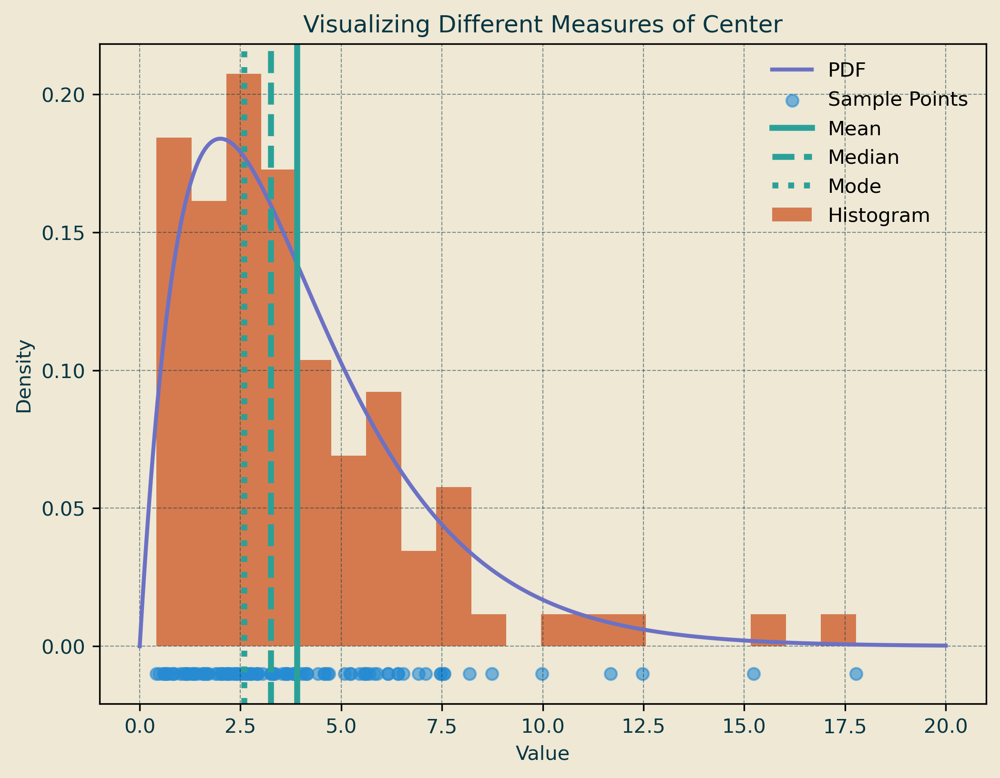
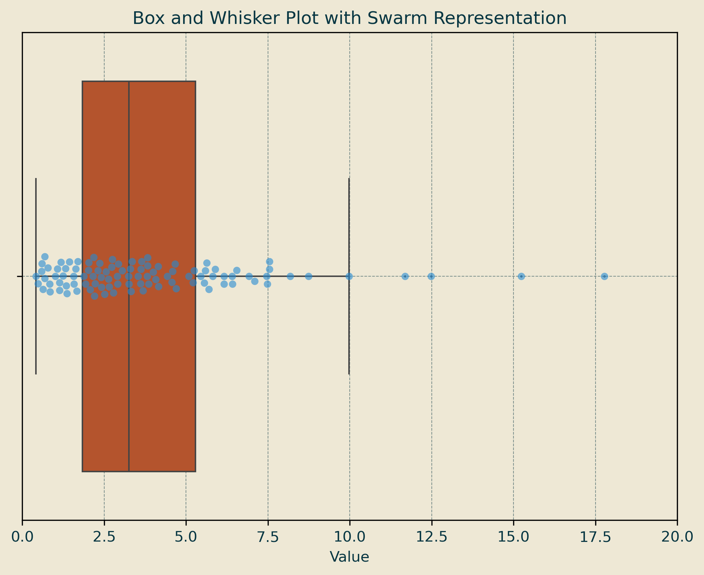

Intro To Statistics
===================
Statistics helps us make sense of the world around us. Because collecting data from an entire **population** is often impractical or impossible, we typically analyze a **sample**—a smaller, representative subset of the whole.

## Population
The **population** is the entire set of individuals, events, or objects that could be studied or observed.

- **Examples:**
  - All possible hands in a game of blackjack.
  - Every recorded streamflow measurement in Boulder Creek’s history.
  - The heights of all adults in the United States.

In most real-world cases, studying the **entire** population is too costly, time-consuming, or impractical, so we rely on **samples**.

## Sample
A **sample** is a subset of the population, carefully chosen to infer information about the entire group.

- **Examples:**
  - The peak annual streamflows for Boulder Creek over the past 100 years (instead of all possible years).
  - A survey of 1,000 voters to estimate the opinions of an entire country.
  - A quality control test on a batch of 50 microchips from a production run of 10,000.

Since **most** datasets we encounter are **samples**, it is crucial to use proper sampling methods to avoid bias and ensure the results accurately represent the population.

### Why Sampling Matters
If a sample is **random and representative**, we can make **inferences** about the larger population. However, poorly chosen samples can lead to **biased** results that misrepresent reality.

#### Key Terms to Know:
- **Parameter**: A numerical value that describes a characteristic of a population (e.g., the **true** average height of all adults in the U.S.).
- **Statistic**: A numerical value that describes a characteristic of a sample (e.g., the average height based on a **sample** of 1,000 adults).
- **Sampling Bias**: Errors that occur when a sample does not represent the population well (e.g., only surveying college students to estimate national opinions).

> _Most_ datasets we encounter are _Samples_!

##Example
<iframe src="Figures/chi_squared_interactive.html" width="800" height="600"></iframe>
> **Figure:** The **purple line** represents the **Probability Density Function (PDF)** of a **Chi-Squared distribution** with **4 degrees of freedom (DF=4)**. The **orange bars** show a **frequency histogram** of randomly sampled values from the population.

> As the **sample size increases**, the histogram of the **sample** more closely resembles the **PDF of the population**. Both the **population mean** and the **sample mean** are displayed: due to random variation, the sample mean may be close to or far from the population mean. However, as the **sample size grows**, the sample mean is more likely to **converge toward the population mean**.

> A key takeaway: **_Small data sets can provide an inaccurate view of the big picture!_**

# Summary Statistics

When describing a friend, you might use a few generalized terms to simplify their whole being into a few adjectives. (_He_ has _white glasses_ and a _thin_ build.)

Similarly, we describe large datasets with **summary statistics** to provide a general idea of the shape and distribution of the data. These statistics include **measures of center**, which summarize the dataset with a single representative value.

---

## Measures of Center

### Mean (Arithmetic Average)

The **mean** is the sum of all data points divided by the number of points. It represents the **balance point** of the data and is especially meaningful if the data follows a **normal distribution**.

\[
\mu = \frac{\sum x_i}{n}
\]

Where:
- \( x_i \) = Each data point  
- \( n \) = Number of data points  

Example:

For the dataset \([2, 4, 6, 8]\):

\[
\mu = \frac{2+4+6+8}{4} = \frac{20}{4} = 5
\]

The mean is **5**.

---

### Median (Middle Value)

The **median** is the middle value in a dataset when arranged in ascending order. If the number of data points is even, the median is the average of the two middle values.

- The **median** corresponds to the **2nd quartile (50th percentile)**, meaning half the values are below it, and half are above it.

Example:

- For the dataset \([2, 3, 7]\), the median is **3**.
- For the dataset \([2, 3, 7, 8]\), the median is:

\[
\frac{3 + 7}{2} = 5
\]

The median is **5**.

---

### Mode (Most Frequent Value)

The **mode** is the most frequently occurring value(s) in a dataset. A dataset can have:
- **One mode** (unimodal)
- **Multiple modes** (bimodal or multimodal)
- **No mode** (if all values occur with equal frequency)

Example:

- For the dataset \([1, 2, 2, 3, 4]\), the mode is **2** (since it appears most frequently).
- For the dataset \([1, 1, 2, 2, 3]\), the modes are **1 and 2** (bimodal).
- For \([1, 2, 3, 4]\), there is **no mode**.

---

> **Figure** The _Mean_, _Median_, and _Mode_ are all different ways to estimate the center of a data set. They all come with their strengths and weaknesses.

#### Why These Measures Matter
Each measure of center tells us something different about the data:
- **Mean** is useful for normally distributed data but is sensitive to outliers.
- **Median** is robust against outliers and skewed data.
- **Mode** is helpful for identifying common values or categorical data trends.

Using these together helps create a complete picture of the dataset.
---

# Measures of Spread

While **measures of center** (mean, median, mode) give us a single representative value for a dataset, they don’t tell us how **spread out** the data is. Two datasets can have the same mean but vastly different distributions. **Measures of spread** help us understand variability and distribution.

---

## Range (Min/Max)
The **range** is the difference between the maximum and minimum values in a dataset.

\[
\text{Range} = \text{Max} - \text{Min}
\]

- **Max**: The largest value in the dataset.
- **Min**: The smallest value in the dataset.

The range provides a simple sense of spread but can be **misleading** if the dataset contains outliers.

---

## Standard Deviation (σ)
The **standard deviation** measures how much individual data points deviate from the mean. A higher standard deviation means the data is more spread out.

\[
\sigma = \sqrt{\frac{\sum (x_i - \mu)^2}{n}}
\]

Where:
- \( x_i \) = Each data point
- \( \mu \) = Mean of the dataset
- \( n \) = Number of data points

---

## Interquartile Range (IQR)
The **interquartile range (IQR)** measures the spread of the middle 50% of the data, making it useful for datasets with outliers.

\[
\text{IQR} = Q_3 - Q_1
\]

- **\(Q_1\) (1st quartile):** The median of the lower half of the data (25th percentile).
- **\(Q_3\) (3rd quartile):** The median of the upper half of the data (75th percentile).
- **IQR** represents the middle 50% of the data.

A higher IQR means more variability in the middle of the dataset.

---

> **Figure** This is another visualization of the same data shown above. The box plot and swarm plot both help visualize the spread of the data and highlight any outliers. The box plot summarizes the distribution using quartiles, while the swarm plot shows individual data points, making it easier to see clustering and deviations.

## Summary of Measures of Spread

| Measure        | Definition | Strengths | Weaknesses |
|---------------|------------|------------|-------------|
| **Range** | Max - Min | Simple to calculate | Sensitive to outliers |
| **Standard Deviation** | Avg. deviation from mean | Uses all data points | Affected by outliers |
| **Interquartile Range (IQR)** | Spread of middle 50% of data | Less affected by outliers | Ignores extreme values |

---

### Why These Measures Matter
- **Standard deviation** is best when data is **normally distributed**.
- **IQR** is better when the data has **outliers** or is **skewed**.

By combining these measures, we get a more complete picture of how data is distributed.

